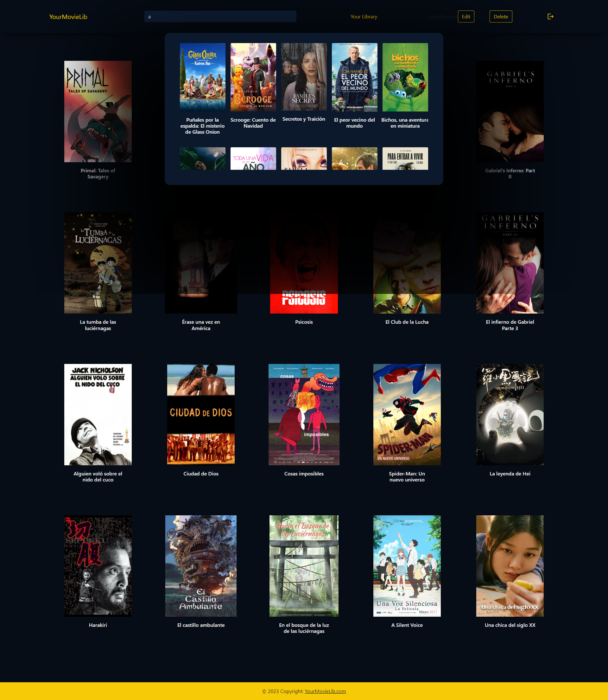

# Project Title

This project was dedicated to developing a movie library which could be used for different purposes. Firstly, you can checkout any film you want (and that exists in our database) and see interesting information about it. Its poster and a little sinopsis, its budget and year of release, how much it grossed in income and how long the film is... etc. This feature is available for everyone without having logged in the app, however when you do sign-up and log in, you'll be able to also, rate films and leave a small comment with your opinion so that you can slowly build a library of watched films that you can go back to over the years. It will come very handy in the future for recommendations and reference.

###### Technologies Used:

· HTML
· CSS
· Javascript
· PHP - OOP.

For design and planning:

· Adobe XD
· Figma

###### Planning phase vs reality:

###### Userflow Diagram:

###### Initial Wireframes and project projection:

###### Individual Film page Wireframe.

###### Individual Film page:

###### Films page:

###### Films page search bar:

###### Getting Started / Prerequisites:

In order to install and run this project in your local computer, it is necessary that you install XAMPP in your computer. After doing so, create a folder inside the XAMPP application which will be accessed from your code editor in the htdocs folder. Here is the link to the installation.

###### Difficulties encountered:

· Joining the different elements of code from different branches.
· Login system.
· Finding the perfect connection and combination of Javascript and PHP.

###### Lessons Learned (to be improved):

· Being careful of not going too apart with Git Branches.
· Planning out more carefully the development of branches.
· Planning out for how the different classes will communicate and work together.

###### Team

Lander Sola Aguirre
Jose Torres
Dayan Álvarez
Luis Alarcón de la Lastra

